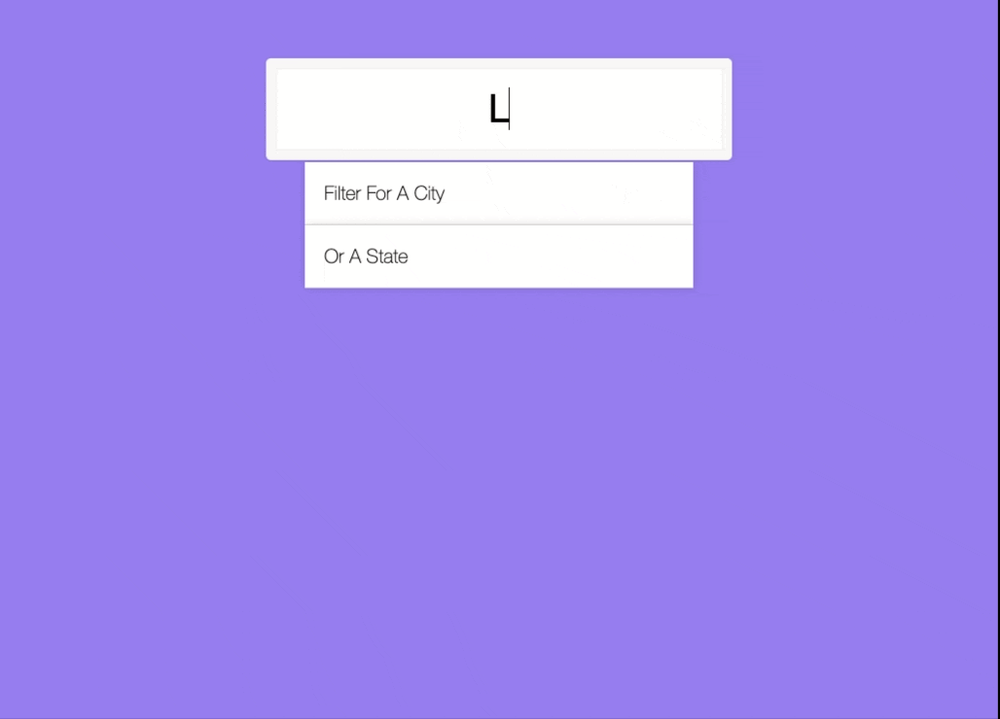

## day 06

<h1 align="center"> Ajax Type Ahead </h1>

> In this project I used event Listeners, Promises, Array functions and match() and replace() of RegExp.

##

### ✨ [Demo](https://mosaif00.github.io/30-Days-JavaScript-Challenge/06-Ajax-Tyep-Ahead/index.html)

##



## Features & Usage

```sh
- used event listener.
- used fetch API
- used RegExp
```

## 🤝 Contributing

Contributions, issues and feature requests are welcome!<br />Feel free to check [issues page](https://github.com/MoSaif00/30-Days-JavaScript-Challenge/issues).
