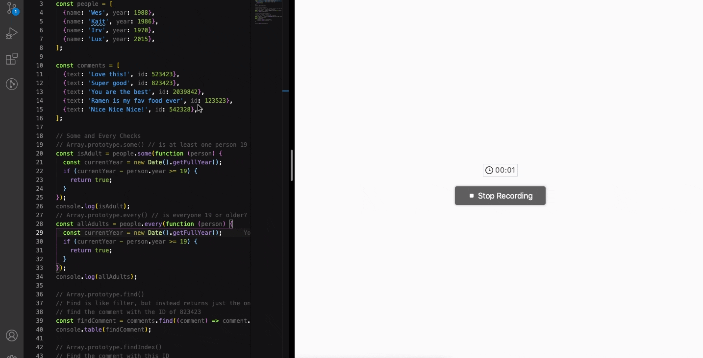

## day 07

<h1 align="center"> Array Cardio (day two) </h1>

> I learned to use array functions : some , every, find, splice and slice ,

##

### ✨ [Demo](https://mosaif00.github.io/30-Days-JavaScript-Challenge/07-Array-Cardio-02/index.html)

##



## Features & Usage

```sh
- some()
- every()
- find ()
- findIndex()
- splice()
- slice()
```

## 🤝 Contributing

Contributions, issues and feature requests are welcome!<br />Feel free to check [issues page](https://github.com/MoSaif00/BookMarker-App/issues).
