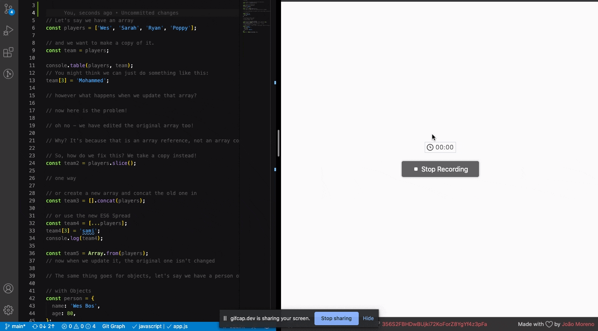

## day 14

<h1 align="center"> JavaScript References VS Copying </h1>

> I learned about Arrays references and copy and it was kind of refreshing to concept as well with Object references and copy

##

### ✨ [Demo](https://mosaif00.github.io/30-Days-JavaScript-Challenge/14-JavaScript-References-Vs-Copying/index.html)

##

## Features & Usage

## 🤝 Contributing

Contributions, issues and feature requests are welcome! Feel free to check [issues page](https://github.com/MoSaif00/30-Days-JavaScript-Challenge/issues).
