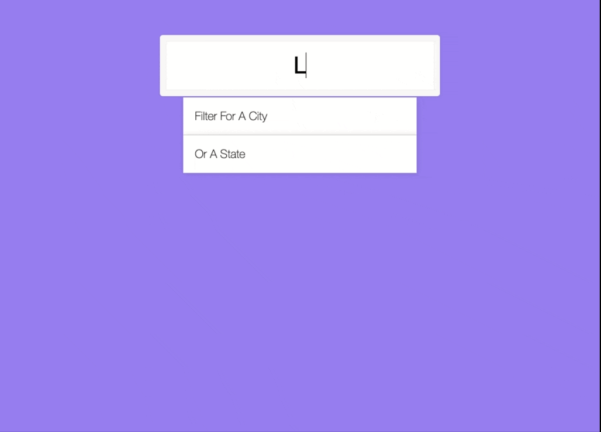
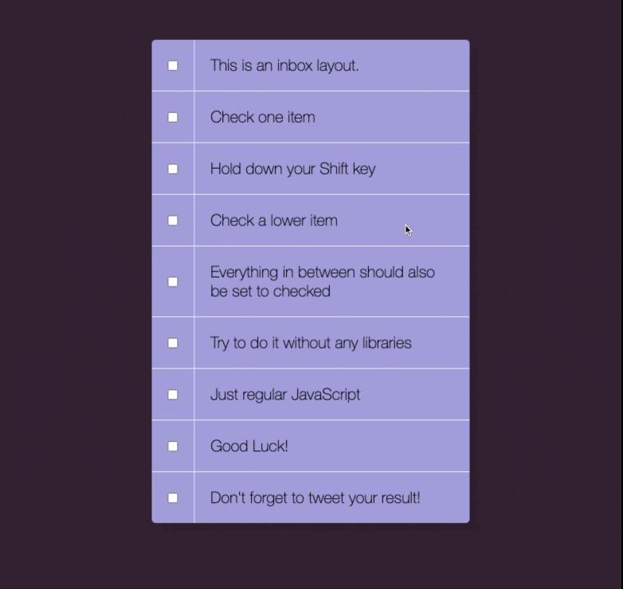
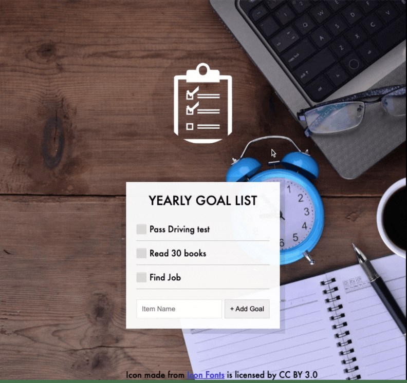

# 30-Days-JavaScript-Challenge

This is a JavaScript practice with JavaScript30[JavaScript30](https://javascript30.com/) by Wes Bos without any frameworks, no compilers, no boilerplate, and no libraries.

## day 1

### JS Drum Kit

## day 2

### JS + CSS Clock

## day 3

### Update CSS Variables with JS

## day 4

### Array Cardio (day one)

## day 5

### Flex-Panels-Image-Gallery

06-Ajax-Tyep-Ahead

## day 6

### Ajax-Tyep-Ahead

## day 7

### Array Cardio (day two)

## day 8

### Fun with HTML5 Canvas

## day 9

### Dev Tools

## day 10

### Hold Shift And Check Checkboxes

## day 11

### Custom HTML5 Video Player

## day 12

### Key Detection

## day 13

### Slide in on Scroll

## day 14

### JavaScript References VS Copying

## day 15

### LocalStorage

## day 16

### Mouse Move Shadow

## day 17

### Sort Without Articles

## day 18

### Adding Up Times With Reduce

#
