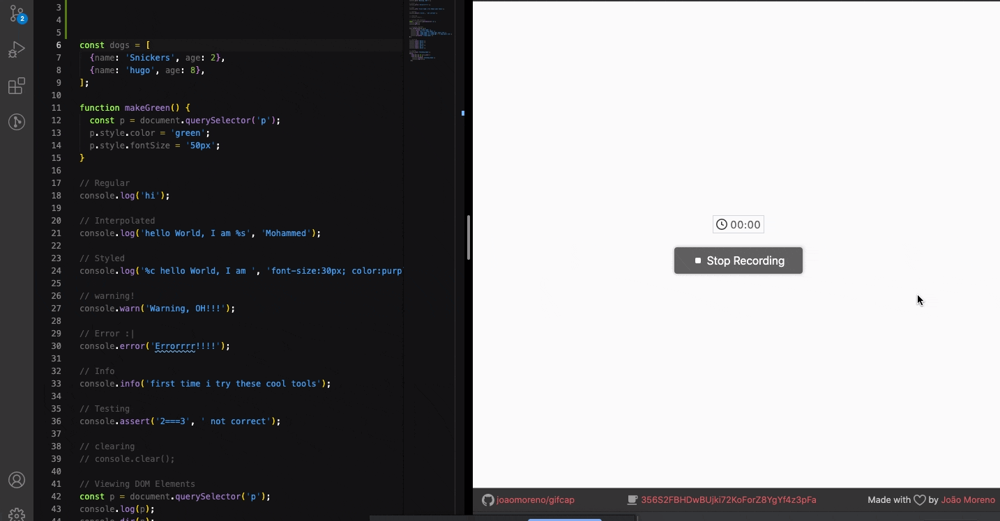

# 30-Days-JavaScript-Challenge

In this Repository i just practiced [30 Days Of JavaScript](https://javascript30.com/), I got to grasp some new information and tricks to use on JavaScript.

## day 1

### JS Drum Kit

## day 2

### JS + CSS Clock

## day 3

### Update CSS Variables with JS

## day 4

### Array Cardio (day one)

## day 5

### Flex-Panels-Image-Gallery

06-Ajax-Tyep-Ahead

## day 6

### Ajax-Tyep-Ahead

## day 7

### Array Cardio (day two)

## day 8

### Fun with HTML5 Canvas

## day 9

### Dev Tools

## day 10

### Hold Shift And Check Checkboxes

