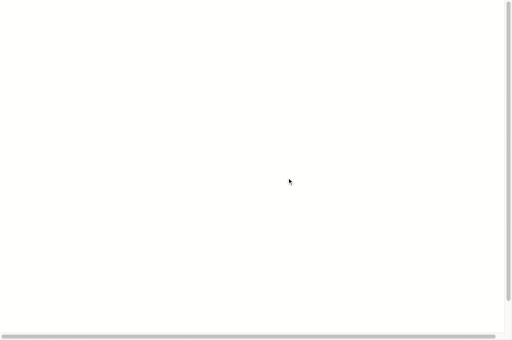

## day 08

<h1 align="center">Fun with HTML5 Canvas  </h1>

> I learned how use Canvas and deal with drawing and how to use the HSL for coloring .

##

### ✨ [Demo](https://mosaif00.github.io/30-Days-JavaScript-Challenge/08-Fun-With-HTML5-Canvas/index.html)

##



## Features & Usage

```sh
- used Canvas

```

## 🤝 Contributing

Contributions, issues and feature requests are welcome!<br />Feel free to check [issues page](https://github.com/MoSaif00/BookMarker-App/issues).
