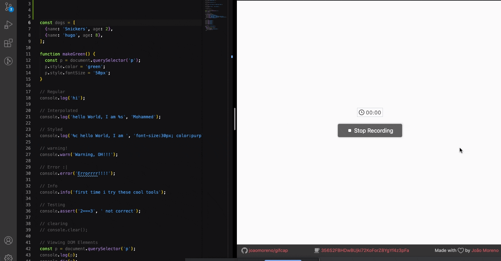

## day 09

<h1 align="center"> DevTool </h1>

> I learned some of Console tricks and how to clear the console .

##

### ✨ [Demo](https://mosaif00.github.io/30-Days-JavaScript-Challenge/09-Dev-Tools/index.html)

##



## Features & Usage

```sh
- Console tricks
- clear the console panel
- use console.table
```

## 🤝 Contributing

Contributions, issues and feature requests are welcome!<br />Feel free to check [issues page](https://github.com/MoSaif00/30-Days-JavaScript-Challenge/issues).
