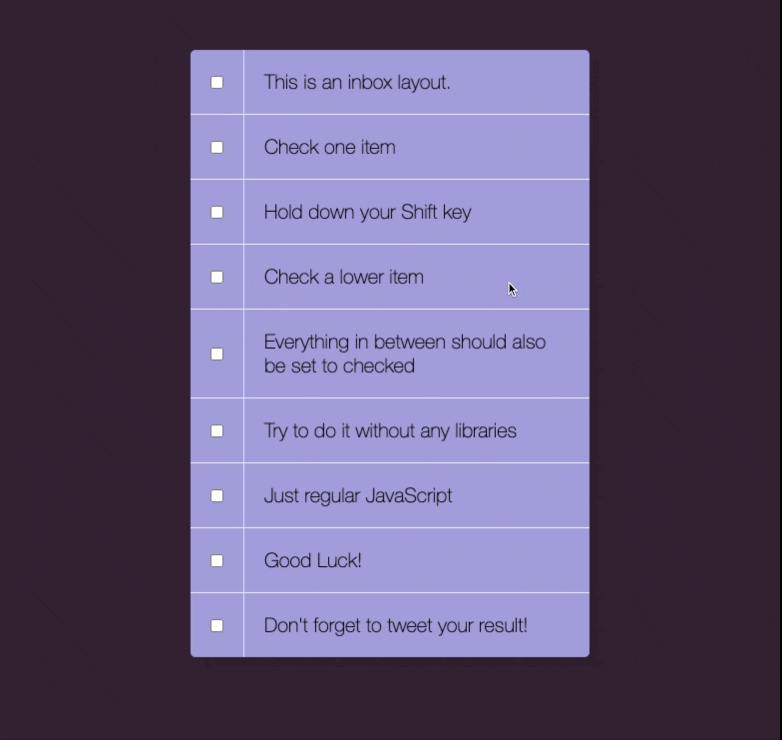

## day 10

<h1 align="center"> Hold Shift And Check Checkboxes </h1>

> Learned how to select the elements by the type key.

##

### ✨ [Demo](https://mosaif00.github.io/30-Days-JavaScript-Challenge/10-Hold-Shift-And-Check-Checkboxes/index.html)

##



## Features & Usage

```sh
- you can select many points by holding shift key
```

## 🤝 Contributing

Contributions, issues and feature requests are welcome!<br />Feel free to check [issues page](https://github.com/MoSaif00/30-Days-JavaScript-Challenge/issues).
