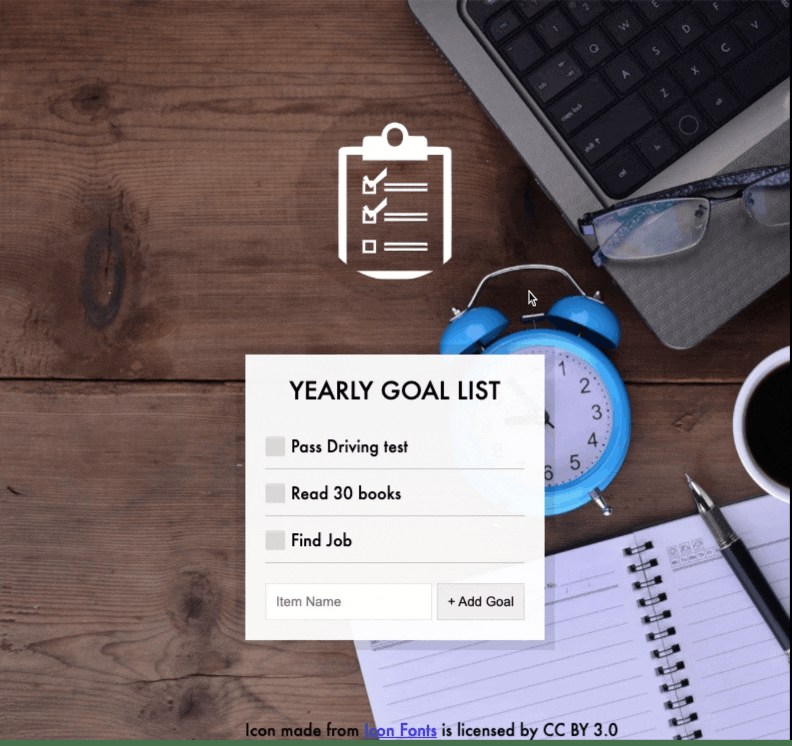

## day 15

<h1 align="center"> LocalStorage </h1>

> learned how to load and save the data in the local storage and how to update it , i learned how to toggle the checked items

##

### ✨ [Demo](https://mosaif00.github.io/30-Days-JavaScript-Challenge/15-LocalStorage/index.html)

##



## Features & Usage

```sh
- add your yearly goals
- storage your goals on the local storge
- You can tick on them anytime
- uses local storage so no worry if you switch the browser any time.
```

## 🤝 Contributing

Contributions, issues and feature requests are welcome!<br />Feel free to check [issues page](https://github.com/MoSaif00/30-Days-JavaScript-Challenge/issues).
